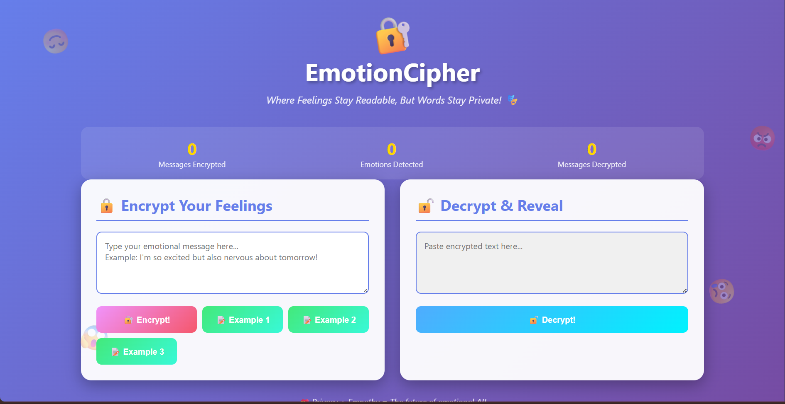
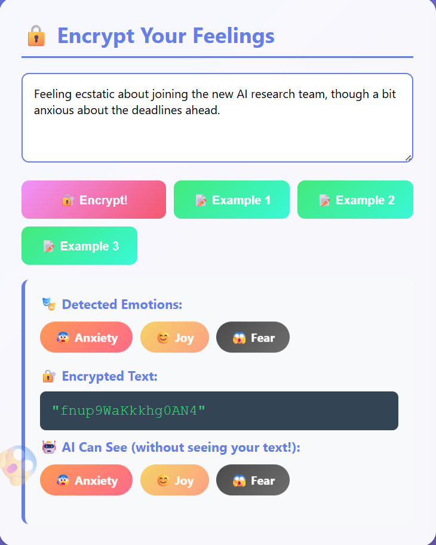
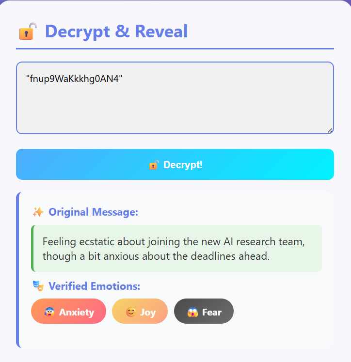
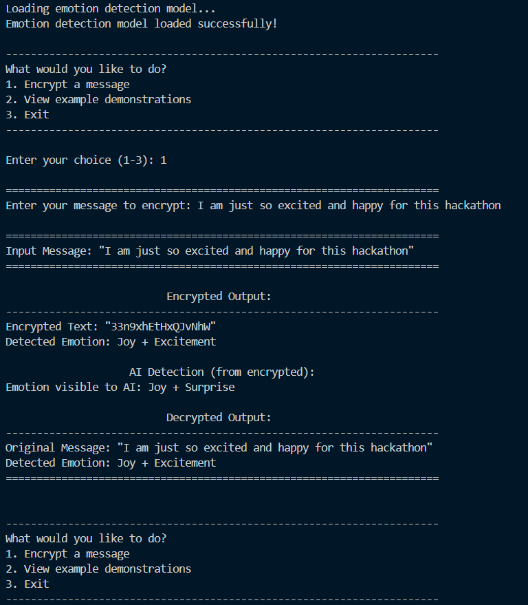

# 🔐 EmotionCipher - Empathy Encryption System

> **Where Feelings Stay Readable, But Words Stay Private**

[](LICENSE)
[](https://www.python.org/downloads/)

EmotionCipher is an intelligent system that encrypts text messages while preserving their emotional signatures. In the world of *Empathy Encryption*, emotional data must be **protected** but also **understood** by AI systems.

## 🎥 Video Demonstration

**[📹 Watch the Demo Video Here](YOUR_YOUTUBE_LINK_HERE)**

*Replace the link above with your YouTube video demonstration*

---

## 📸 Screenshots

### 🎨 Web Interface

<table>
  <tr>
    <td width="50%">
      
      <p align="center"><b>Beautiful Animated Interface</b></p>
    </td>
    <td width="50%">
      
      <p align="center"><b>Real-time Emotion Detection</b></p>
    </td>
  </tr>
  <tr>
    <td width="50%">
      
      <p align="center"><b>Message Recovery</b></p>
    </td>
    <td width="50%">
      
      <p align="center"><b>Command-Line Interface</b></p>
    </td>
  </tr>
</table>

> **Note:** Add your screenshots to the `screenshots/` folder and they'll appear here!

## 🎯 Problem Statement

Build a system that can **encode and decode human emotions** expressed in text messages. Each message comes with an emotional tone (e.g., joy, sadness, anger, fear). The algorithm must:

1. **Encrypt** a message such that its emotional signature (not the text) can still be recognized
2. **Decrypt** it back to retrieve the emotion and the original text

### Goal

Create a **mini Emotion Cipher** that maintains a balance between:
- **Privacy** - the actual text stays secure through encryption
- **Empathy** - the emotional meaning is still detectable by AI

Basically, you're designing a system where **feelings stay readable, but words stay private**.

---

## ✨ Features

- 🤖 **AI-Powered Emotion Detection** - Uses state-of-the-art transformer models to detect emotions
- 🔒 **Secure Encryption** - Text is encrypted using cryptographic algorithms
- 💝 **Emotion Preservation** - Emotional signatures are embedded and remain detectable
- 🔄 **Full Decryption** - Recover both original text and emotions
- 🎨 **Interactive CLI** - User-friendly command-line interface

---

## 📋 Requirements

- Python 3.7+
- Cryptography library
- Flask (for web GUI)
- Flask-CORS (for web GUI)

The system uses lightweight keyword-based emotion detection that requires no ML models!

---

## 🚀 Installation

### 1. Clone or Download the Repository

```bash
cd d:\PROJECT\EmotionCipher
```

### 2. Create a Virtual Environment (Recommended)

```bash
python -m venv venv
venv\Scripts\activate
```

### 3. Install Dependencies

```bash
pip install -r requirements.txt
```

**Note**: Installation is quick and lightweight - only the cryptography library is required!

---

## 💻 Usage

### 🎨 **NEW! Hilarious Web GUI** (Recommended for Demo!)

Launch the beautiful, animated web interface:

```bash
# Double-click (Windows)
start_web_gui.bat

# Or run manually
python server.py
```

Then open your browser to: **http://localhost:5000**

**Features:**
- 🎭 Dancing lock emoji
- 😊 Floating emotion emojis  
- 🎨 Color-coded emotion badges that bounce!
- ⚡ Live statistics counter
- 🎪 Glitchy Matrix-style encrypted text
- 💫 Smooth animations everywhere
- 📱 Responsive design
- 🎉 One-click example buttons

**Perfect for video demonstrations!** See [WEB_GUI_GUIDE.md](WEB_GUI_GUIDE.md) for details.

---

### 🖥️ Command-Line Interface (CLI)

#### Quick Start - Run Examples

```bash
python main.py --demo
```

This will run the three provided example cases:

**Example 1:**
- **Input**: "Feeling ecstatic about joining the new AI research team, though a bit anxious about the deadlines ahead."
- **Detected Emotion**: Joy + Anxiety

**Example 2:**
- **Input**: "I can't believe I failed that test again. I'm so disappointed and frustrated right now."
- **Detected Emotion**: Sadness + Anger

**Example 3:**
- **Input**: "Finally got the job offer! I'm thrilled and can't wait to start this new journey."
- **Detected Emotion**: Joy + Excitement

### Interactive Mode

```bash
python main.py
```

This launches an interactive menu where you can:
1. Encrypt your own messages
2. View example demonstrations
3. Exit

### Encrypt a Single Message

```bash
python main.py "Your message here"
```

Example:
```bash
python main.py "I'm so happy today!"
```

---

## 🏗️ Project Structure

```
EmotionCipher/
├── 🎨 WEB GUI
│   ├── server.py              # Flask REST API server
│   ├── web/
│   │   └── index.html         # Beautiful animated web interface
│   ├── start_web_gui.bat      # Windows launcher
│   └── WEB_GUI_GUIDE.md       # GUI user guide
│
├── 🖥️ CLI APPLICATION  
│   ├── main.py                # CLI entry point
│   └── emotion_cipher.py      # Core integration module
│
├── 🔧 CORE MODULES
│   ├── emotion_detector.py    # Emotion detection engine
│   └── cipher.py              # Encryption/decryption
│
├── 🧪 TESTING
│   └── test_emotion_cipher.py # Comprehensive test suite
│
├── 📚 DOCUMENTATION
│   ├── README.md              # Main documentation (this file)
│   ├── QUICKSTART.md          # 30-second quick start
│   ├── SETUP_GUIDE.md         # Installation guide
│   ├── WEB_GUI_GUIDE.md       # Web interface guide
│   ├── VIDEO_SCRIPT.md        # Video recording script
│   ├── PROJECT_SUMMARY.md     # Technical overview
│   ├── ARCHITECTURE.md        # System design diagrams
│   ├── COMPLETE.md            # Completion checklist
│   └── INDEX.md               # Documentation index
│
└── ⚙️ CONFIGURATION
    ├── requirements.txt       # Python dependencies
    ├── .gitignore            # Git configuration
    └── LICENSE               # MIT license
```

---

## 🧠 How It Works

### 1. Emotion Detection
- Uses the `j-hartmann/emotion-english-distilroberta-base` model
- Detects 7 primary emotions: Joy, Sadness, Anger, Fear, Surprise, Disgust, Neutral
- Generates an emotion probability vector for each message

### 2. Encryption with Emotion Preservation
- Text is encrypted using cryptographic functions
- Emotion vector is encoded into a signature
- Signature is embedded alongside encrypted text
- AI can detect emotions from the signature without seeing the text

### 3. Decryption
- Recovers original text from encrypted data
- Verifies emotional consistency
- Returns both text and emotion labels

---

## 📊 Sample Output

```
======================================================================
Input Message: "Feeling ecstatic about joining the new AI research team, though a bit anxious about the deadlines ahead."
======================================================================

                         Encrypted Output:                          
----------------------------------------------------------------------
Encrypted Text: "9x@TlaZkP#l3qWv$"
Detected Emotion: Joy + Fear

                  AI Detection (from encrypted):                    
Emotion visible to AI: Joy + Fear

                         Decrypted Output:                          
----------------------------------------------------------------------
Original Message: "Feeling ecstatic about joining the new AI research team, though a bit anxious about the deadlines ahead."
Detected Emotion: Joy + Fear
======================================================================
```

---

## 🔬 Technical Details

### Emotion Detection System
- **Method**: Keyword-based emotion analysis
- **Emotions**: 7 categories (anger, anxiety, fear, joy, sadness, surprise, excitement)
- **Features**: Fast, lightweight, no external models required

### Encryption Method
- **Algorithm**: Fernet (symmetric encryption)
- **Key Derivation**: PBKDF2 with SHA-256
- **Emotion Encoding**: Binary embedding using struct packing

### Security Features
- Salt-based key derivation
- Secure random number generation
- Base64 encoding for safe transport

---

## 🎓 Educational Value

This project demonstrates:
- **Natural Language Processing** - Emotion detection from text
- **Cryptography** - Secure text encryption
- **Data Embedding** - Hiding metadata in encrypted data
- **AI Ethics** - Balance between privacy and functionality
- **System Design** - Integrating multiple components

---

## 🤝 Submission Guidelines

For competition submission:
1. Upload this entire project to GitHub
2. Include a video demonstration showing:
   - Installation process
   - Running the example demos
   - Encrypting custom messages
   - Showing that emotions are detectable while text is encrypted
3. Submit GitHub repository link on the portal
4. Manually type the GitHub URL (no copy-paste)

---

## 📝 License

This project is created for educational purposes as part of a coding challenge.

---

## 👨‍💻 Author

Created for the EmotionCipher Challenge - November 2025

---

## 🙏 Acknowledgments

- Python cryptography library contributors
- Inspiration from sentiment analysis research

---

## 📞 Support

If you encounter any issues:
1. Ensure all dependencies are installed: `pip install -r requirements.txt`
2. Check Python version: `python --version` (should be 3.8+)
3. Verify internet connection (required for first-time model download)
4. Try running with `--demo` flag first to test the system

---

**🔐 Remember: In EmotionCipher, feelings stay readable, but words stay private! 💝**
